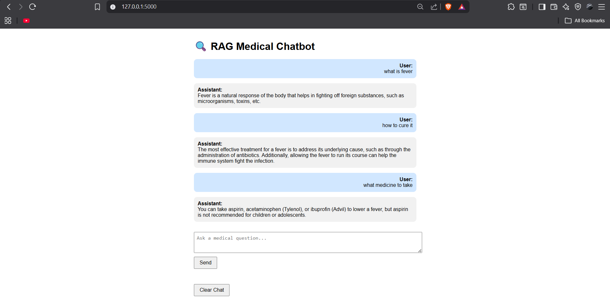

# 🩺 RAG Medical Chatbot — AI-Powered Medical Q&A Assistant

A Flask application that provides **context-aware medical answers** using **Retrieval-Augmented Generation (RAG)**.  
Upload your **medical documents** (PDFs, reports, or research papers), and the chatbot retrieves relevant information before generating accurate, AI-powered responses.

This project integrates **LangChain**, **FAISS**, **HuggingFace LLM**, and **Flask** to deliver a fast and reliable medical Q&A experience.

---

---

## 🚀 Features

- Upload medical documents (PDF, DOCX) to build a knowledge base  
- Ask medical questions in natural language  
- AI retrieves relevant content and generates context-aware answers  
- Supports multi-turn conversations  
- Clean and interactive Flask interface  
- Fast and accurate retrieval using vector embeddings (FAISS)  
- Can handle complex medical queries and terminology  
- Option to expand knowledge base with new documents  

---

## 🛠️ Tech Stack Overview

- **LLM:** HuggingFace LLM  
- **Vector Database:** FAISS 
- **Framework:** LangChain  
- **UI:** Flask
- **Document Processing:** PyPDF2
- **Environment Management:** python-dotenv  
- **Backend Logic:** RAG retrieval + QA chain  

---

## 📦 Project Setup

1. Install all required Python dependencies  
2. Create a `.env` file and add your **API keys** (HuggingFace)  
3. Run the Streamlit application  
4. Upload medical documents to build the knowledge base  
5. Ask questions and get instant AI-powered answers  

---

## 📂 Folder Structure

- **app.py** — Main Streamlit application  
- **src/components/retriever.py** — Document retrieval & embedding logic  
- **src/components/qa_chain.py** — RAG question-answering pipeline  
- **src/utils/logger.py** — Logging utility  
- **src/utils/custom_exception.py** — Custom exception handler  
- **src/config/config.py** — API key loading  
- **.env** — API keys  
- **requirements.txt** — Project dependencies  

---

## 🧠 How the App Works

- User uploads **medical documents**  
- Documents are processed and converted into **vector embeddings**  
- User asks a medical question  
- RAG system **retrieves relevant document content**  
- LLM generates a **coherent, context-aware answer**  
- Answer is displayed in a clean UI  

---

## 📸 Use Cases

- Quick medical research and references  
- Healthcare students & professionals for learning  
- Patient education (non-diagnostic)  
- Hospitals or clinics building internal medical knowledge assistants  
- Medical content summarization  

---

## 🔮 Future Enhancements

- Real-time voice-based Q&A  
- Integration with hospital EHR systems  
- Multi-language support  
- PDF export of chat sessions  
- More advanced summarization and follow-up question handling  
- Chatbot personalization per user  

---

## ⭐ Support This Project

If you like this project, consider starring the repository or sharing it with others!

